 ## Client Server Architecture using MySQL
 
Step 1. Create and configure two linux-based virtual servers (EC2 instance in AWS)

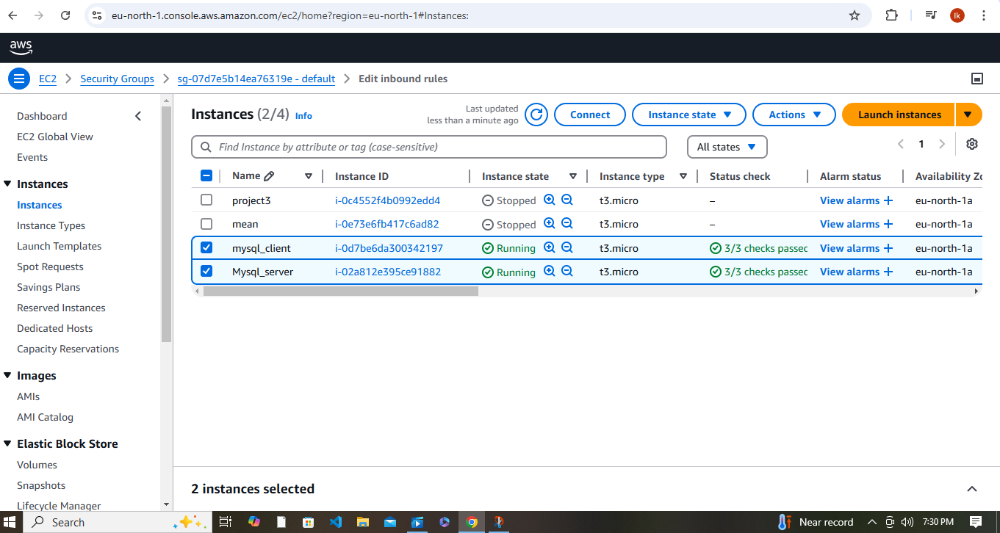

### On mysql server Linux Server install MySQL Server software.
ssh into an istance using the following:
``` sh
ssh -i proj3.pem ubuntu@13.61.6.100
```
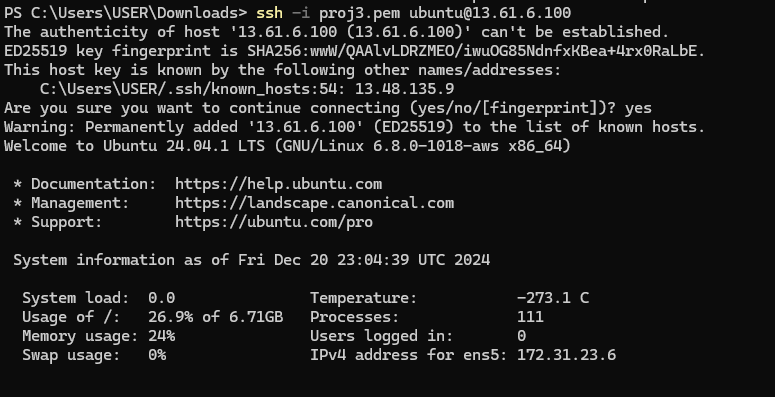
``` sh
sudo apt update
```
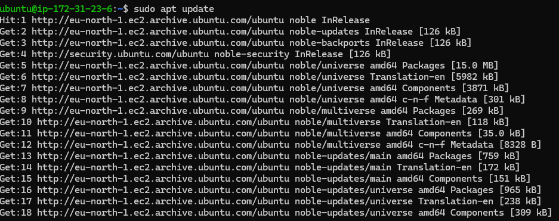
``` sh
sudo apt upgrade
```
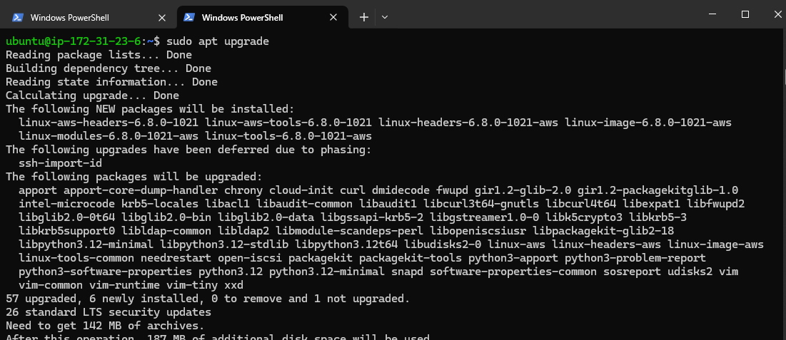
``` sh
sudo apt install mysql-server
```
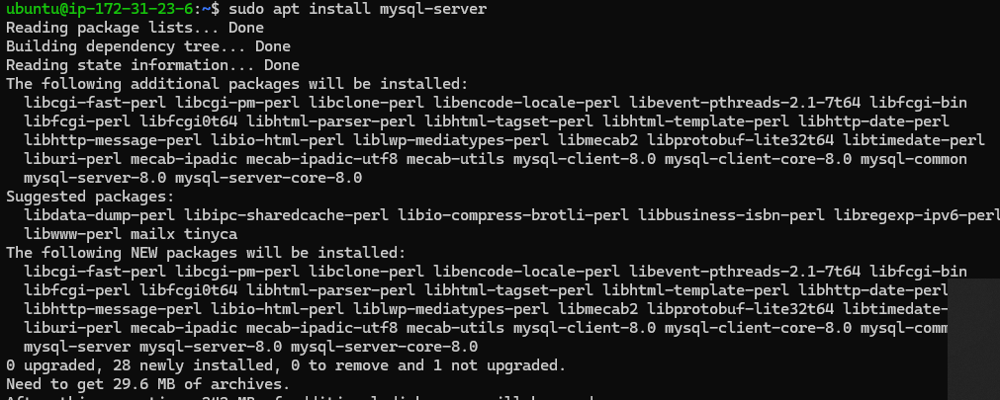
**I start the mysql service**
``` sh
sudo systemctl start mysql
```
**Check the Status**
``` sh
sudo systemctl status mysql
```
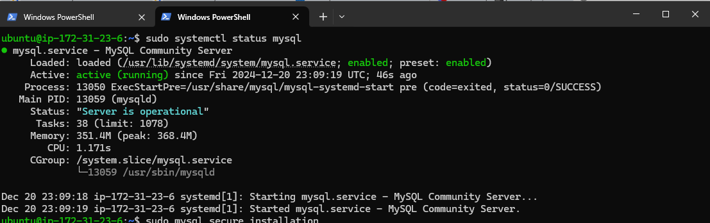
### On mysql client Linux Server install MySQL Client software.
**I copy the public Ip to ssh into the client _instance**
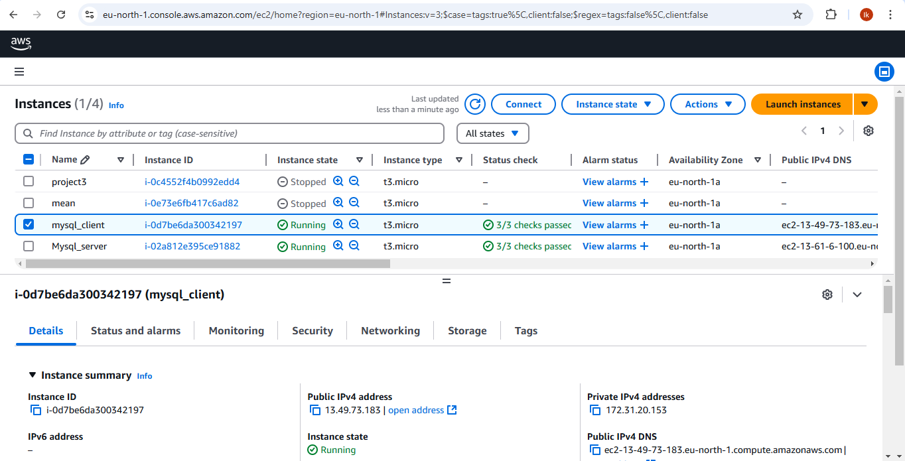
``` sh
ssh -i proj3.pem ubuntu@13.49.73.183
```
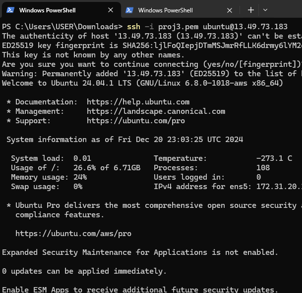
**I update the Ubuntu**
``` sh
sudo apt update
```
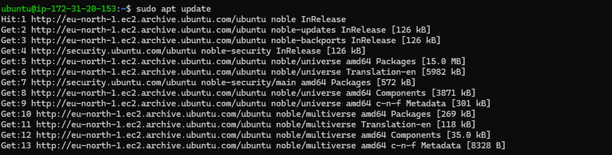
**I upgrade the Ubuntu**
``` sh
sudo apt uprade
```
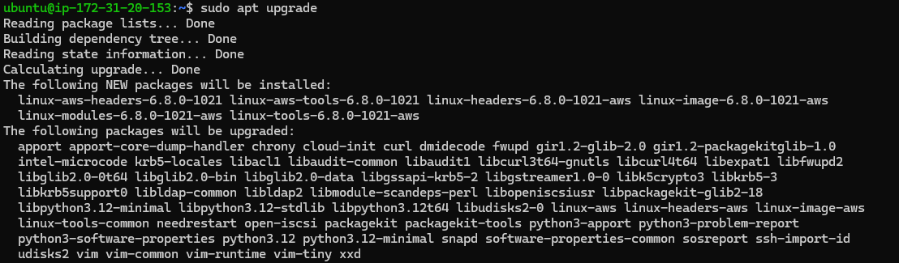
**I install the Mysql-client**
``` sh
sudo apt install mysql-client
```
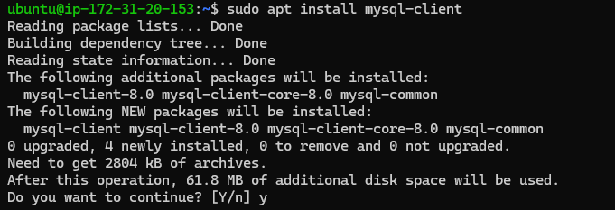
**I move back to the server.**  
**I started the security strengthening**
``` sh
sudo mysql_secure_installation
```
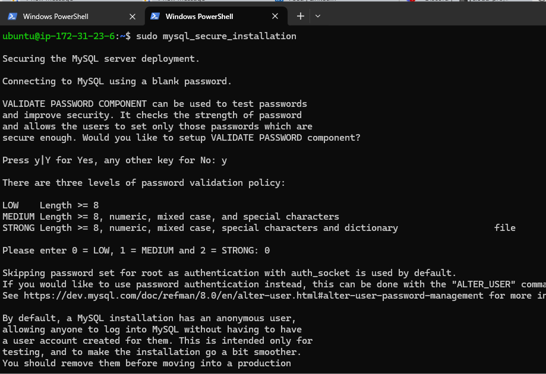
**I access mysql using the root privilege, I then proceed to creating a user**
``` sh
sudo mysql 
```
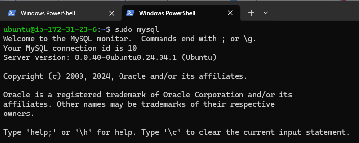
**I created a USER**     
**I created a database**
``` sh
CREATE USER 'chuks'@'%' IDENTIFIED BY 'Pas$wd12'
CREATE DATABASE sercli
```
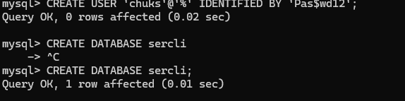
**I logged into the just created user account the same server not mysql-client**
``` sh
mysql -u chuks -p
```
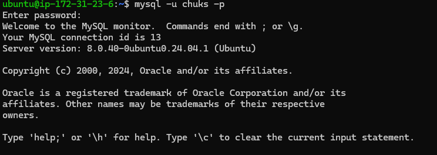
**I grant the user some privilegs**
``` sh
GRANT SELECT, INSERT ON sercli.* TO 'chuks'@'%';
```

**I flush privileges**
``` sh
FLUSH PRIVILEGES
```
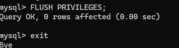  
**MOVE TO MYSQL-CLIENT**
**I SHOW IP**
```sh
sudo  ip addr show
```
**I modify the security group of the mysql-server to allow only the mysql-client to connect in the EC2**
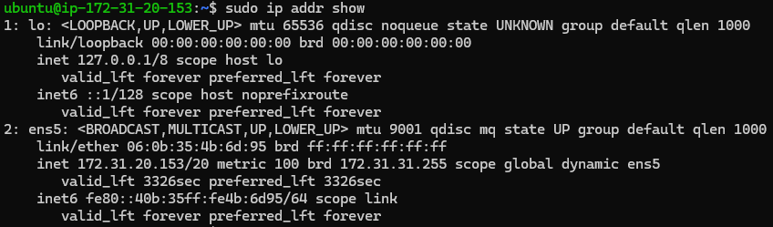
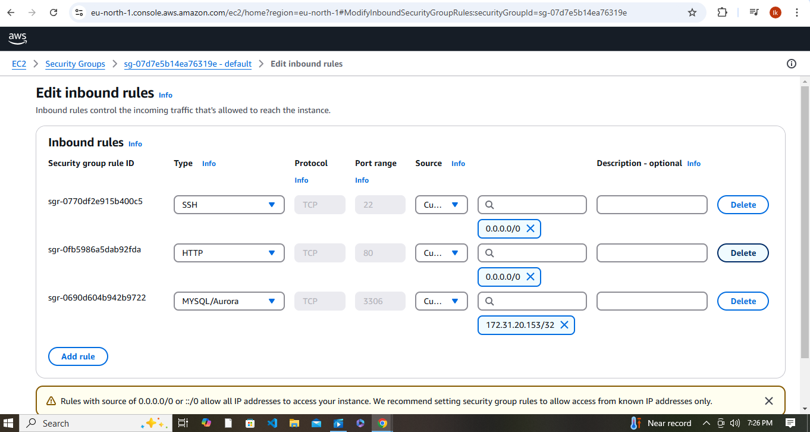
**I moved back to mysql server to allow remote access in the configuration file**
``` sh
sudo vi /etc/mysql/mysql.conf.d/mysqld.cnf
```
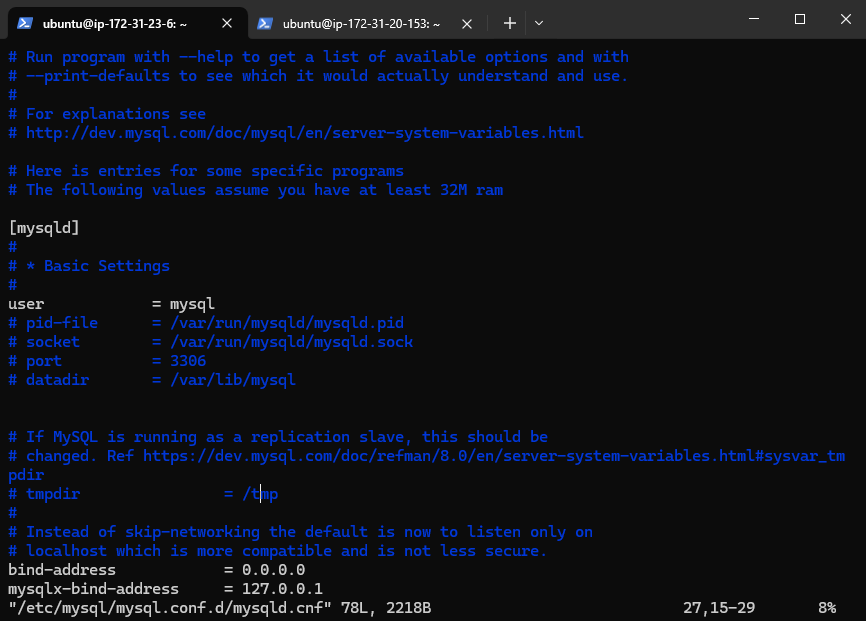
**I restart mysql**
``` sh
sudo systemctl restart mysql
```

**I login from the mysql_client into mysql_server; a good example of the client-server architecture**
``` sh
mysql -u chuks -h 172.31.23.6 -p
```
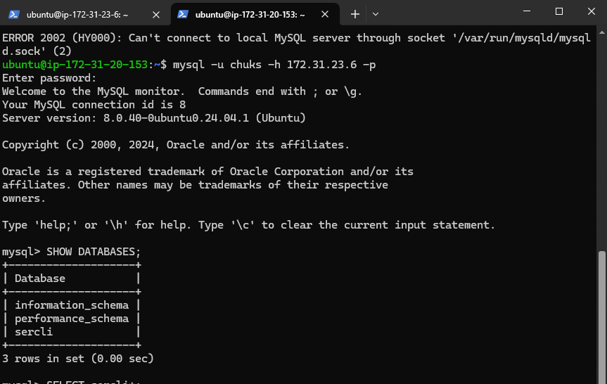